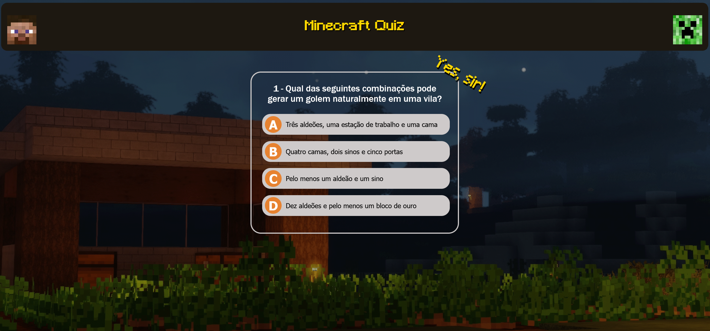
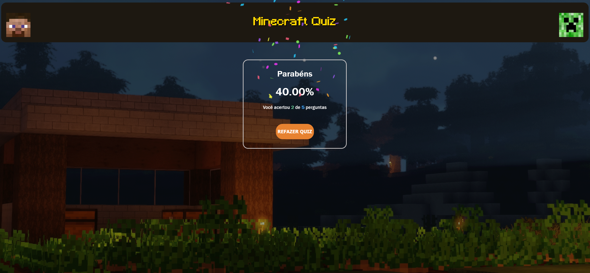
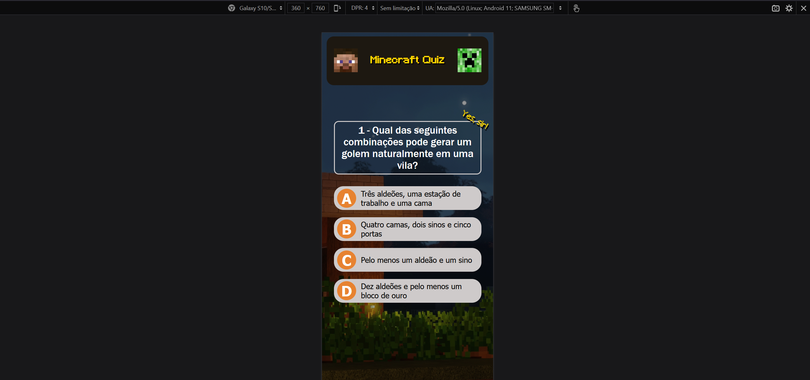
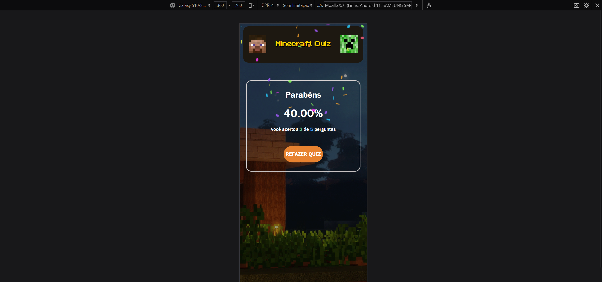

# 🎮 Minecraft Quiz - Projeto Interativo [JS]

Este é um projeto desenvolvido durante o curso de programação de JS, com o objetivo de aplicar conceitos de **HTML**, **CSS** e **JavaScript**, criando um quiz interativo e estilizado (optei pelo tema Minecraft).

---

## 🧠 Sobre o Projeto

O projeto consiste em um quiz de perguntas e respostas com pontuação automática, animações CSS, fontes personalizadas, responsividade para dispositivos móveis e efeitos visuais.

---

## 🌟 Destaques do Projeto

### 🧩 **Funcionalidades: **
| 🏆 Sistema de Pontuação | 🎯 5 Perguntas Progressivas | 📱 Responsivo |
|------------------------|----------------------------|--------------|
| 🎉 Animação de Confete  | 🖋️ Fonte Minecraft Oficial  | 🖥️ Mobile/Desktop |

---

## ✨ Funcionalidades

- 5 perguntas com dificuldade progressiva
- Animação em destaque com texto rotacionado
- Fonte personalizada (`Minecraft.ttf`)
- Plano de fundo animado com `.gif`
- Exibição de pontuação ao final com porcentagem de acertos
- Resposta certa/errada com cores
- Layout responsivo para mobile
- Estilização inspirada no universo Minecraft
- Animação de confete ao final

---

## 💻 Tecnologias utilizadas

- HTML5
- CSS3
- JavaScript
- Fonte personalizada via `@font-face`

---

## 📸 Prints do projeto

### Tela Inicial

### Resultado Final

### Exibição no Mobile

### Exibição no Mobile - Final

---
